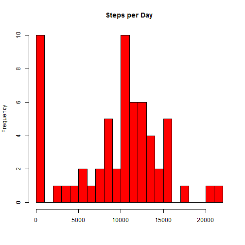
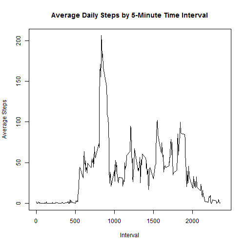
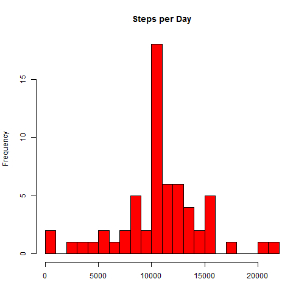
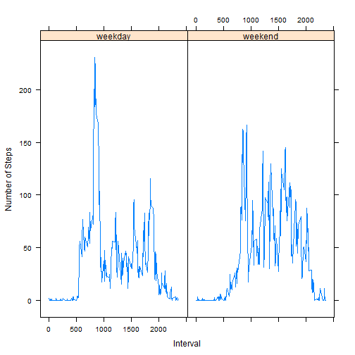

### Loading and Preprocessing Data

```r
setwd("C:/Users/thep3_000/Desktop/Coursera/Reproducible Research")
data = read.csv("activity.csv")
```

### What is the mean total number of steps taken per day?
```
1. Total Number of Steps Taken per Day
```

```r
newdata = aggregate(data$steps, by = list(data$date), FUN = sum, na.rm = TRUE)
colnames(newdata) = c("date", "steps")
print(newdata)
```

```
##          date steps
## 1  2012-10-01     0
## 2  2012-10-02   126
## 3  2012-10-03 11352
## 4  2012-10-04 12116
## 5  2012-10-05 13294
## 6  2012-10-06 15420
## 7  2012-10-07 11015
## 8  2012-10-08     0
## 9  2012-10-09 12811
## 10 2012-10-10  9900
## 11 2012-10-11 10304
## 12 2012-10-12 17382
## 13 2012-10-13 12426
## 14 2012-10-14 15098
## 15 2012-10-15 10139
## 16 2012-10-16 15084
## 17 2012-10-17 13452
## 18 2012-10-18 10056
## 19 2012-10-19 11829
## 20 2012-10-20 10395
## 21 2012-10-21  8821
## 22 2012-10-22 13460
## 23 2012-10-23  8918
## 24 2012-10-24  8355
## 25 2012-10-25  2492
## 26 2012-10-26  6778
## 27 2012-10-27 10119
## 28 2012-10-28 11458
## 29 2012-10-29  5018
## 30 2012-10-30  9819
## 31 2012-10-31 15414
## 32 2012-11-01     0
## 33 2012-11-02 10600
## 34 2012-11-03 10571
## 35 2012-11-04     0
## 36 2012-11-05 10439
## 37 2012-11-06  8334
## 38 2012-11-07 12883
## 39 2012-11-08  3219
## 40 2012-11-09     0
## 41 2012-11-10     0
## 42 2012-11-11 12608
## 43 2012-11-12 10765
## 44 2012-11-13  7336
## 45 2012-11-14     0
## 46 2012-11-15    41
## 47 2012-11-16  5441
## 48 2012-11-17 14339
## 49 2012-11-18 15110
## 50 2012-11-19  8841
## 51 2012-11-20  4472
## 52 2012-11-21 12787
## 53 2012-11-22 20427
## 54 2012-11-23 21194
## 55 2012-11-24 14478
## 56 2012-11-25 11834
## 57 2012-11-26 11162
## 58 2012-11-27 13646
## 59 2012-11-28 10183
## 60 2012-11-29  7047
## 61 2012-11-30     0
```

```
2. Plot Histogram of Data
```

```r
hist(newdata$steps, xlab = "", main = "Steps per Day", col = "red", breaks = 20)
```

 

```
3. Mean and Median of Steps Taken per Day
```

```r
summary(newdata$steps)
```

```
##    Min. 1st Qu.  Median    Mean 3rd Qu.    Max. 
##       0    6778   10400    9354   12810   21190
```

### What is the daily average activity pattern?
```
1. Make a time series plot
```

```r
dailydata = aggregate(data$steps, by = list(data$interval), FUN = mean, na.rm = TRUE)
colnames(dailydata) = c("Interval", "Meansteps")
plot(Meansteps ~ Interval, data = dailydata, type = "l", xlim = c(0, 2400), ylab = "Average Steps", main = "Average Daily Steps by 5-Minute Time Interval")
```

 

```
2. Which 5-minute interval on average contains the most number of steps?
```

```r
dailydata[which(dailydata$Meansteps == max(dailydata$Meansteps)), ]
```

```
##     Interval Meansteps
## 104      835  206.1698
```

### Imputing Missing Values
```
1. Total number of missing values in the dataset
```

```r
length(data$steps[which(is.na(data$steps) == TRUE)])
```

```
## [1] 2304
```

```
2-3. Create a new dataset equal to the original with missing data filled in. 
```

```r
impdata = data

# Match missing data to daily average for 5-minute interval
for(i in 1:dim(impdata)[1]) {
  if(is.na(impdata$steps[i])) {
    impdata$steps[i] = dailydata[which(dailydata$Interval == impdata$interval[i]),2]
  }
}

# Check no missing data
length(impdata$steps[which(is.na(impdata$steps) == TRUE)])
```

```
## [1] 0
```

```r
# No data missing
```


```
4. (part 1) Make a histogram of the total number of steps taken each day 

```

```r
# Aggregate data
dailydataimp = aggregate(impdata$steps, by = list(impdata$date), FUN = sum, na.rm = TRUE)
colnames(dailydataimp) = c("date", "steps")

# Create histogram
hist(dailydataimp$steps, xlab = "", main = "Steps per Day", col = "red", breaks = 20)
```

 

```
4. (part 2) Calculate and report the mean and median total number of steps taken per day
```

```r
summary(dailydataimp$steps)
```

```
##    Min. 1st Qu.  Median    Mean 3rd Qu.    Max. 
##      41    9819   10770   10770   12810   21190
```

```
4. (part 3) Do these values differ from the estimates from the first part of the assignment? What is the impact of imputing missing data on the estimates of the total daily number of steps?
```
```
The mean and median estimates are higher than they were in the first part of the assignment, but the total daily number of steps is the exact same. 
```

### Are there any differences in activity between weekdays and weekends?
```
1. Create a new factor variable in the dataset with two levels - "weekday" and "weekend" indicating whether a given date is a weekday or weekend day.
```

```r
impdata2 = impdata
impdata2$weekday = weekdays(as.Date(impdata$date))
impdata2$weekday = ifelse((impdata2$weekday == "Saturday" | impdata2$weekday == "Sunday"), "weekend", "weekday")
```

```
2. Make a panel plot containing a time series plot (i.e. type = "l") of the 5-minute interval (x-axis) and the average number of steps taken, averaged across all weekday days or weekend days (y-axis). See the README file in the GitHub repository to see an example of what this plot should look like using simulated data.
```

```r
impdata3 = aggregate(impdata2$steps, by = list(impdata2$interval, impdata2$weekday), FUN = mean, na.rm = TRUE)
colnames(impdata3) = c("Interval", "WeekDay", "Meansteps")

library(lattice)
```

```
## Warning: package 'lattice' was built under R version 3.0.3
```

```r
xyplot(impdata3$Meansteps ~ impdata3$Interval | impdata3$WeekDay, type = "l", ylab = "Number of Steps", xlab = "Interval", )
```

 

